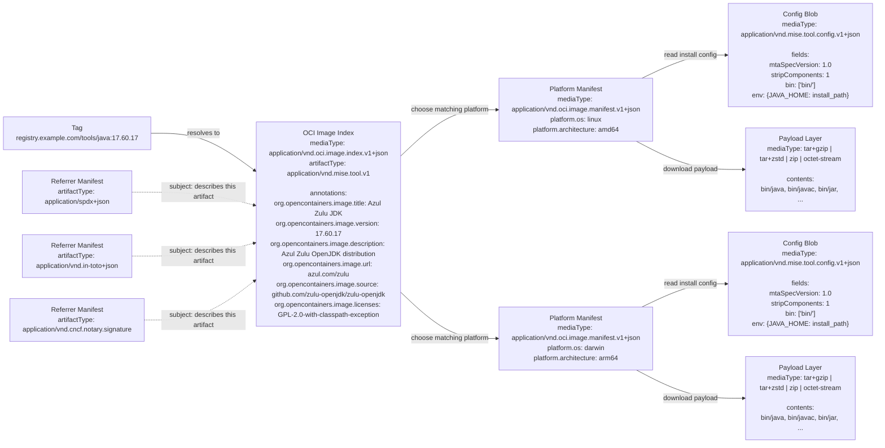

# Mise Tool Artifact (MTA) Specification v1.0

## Overview

The **Mise Tool Artifact (MTA)** specification defines a standardized, multi-platform format for distributing development tools and binaries using [OCI-compatible](https://github.com/opencontainers/image-spec) registries. It extends the tool stub format used by [mise](https://mise.jdx.dev/), but is **tool-agnostic** and can be integrated into any tool version manager, package manager, or provisioning system.

## Goals

- **Multi-platform**: Distribute binaries for Linux, macOS, and Windows using OCI Image Index
- **Registry-native**: Built on OCI Image Spec, Distribution Spec, and standard annotations
- **Tool-agnostic**: Can be used with mise, nix, brew, or any provisioning system
- **Secure**: Leverages OCI referrers for provenance, SBOM, and signature attestations
- **Minimal**: No duplication between layers — metadata lives in annotations, install behavior lives in config

## Design Principles

1. **Single source of truth** — each piece of data lives in exactly one place
2. **OCI standard first** — use existing OCI fields and annotations before introducing custom ones
3. **Separation of concerns** — annotations carry metadata, config carries install behavior, Image Index carries platform routing

## Specification

### Media Types

| Component | Media Type |
|-----------|------------|
| Image Index | `application/vnd.oci.image.index.v1+json` |
| Platform Manifest | `application/vnd.oci.image.manifest.v1+json` |
| Artifact Type | `application/vnd.mise.tool.v1` |
| Config | `application/vnd.mise.tool.config.v1+json` |
| Layer (tar+gzip) | `application/vnd.oci.image.layer.v1.tar+gzip` |
| Layer (tar+zstd) | `application/vnd.oci.image.layer.v1.tar+zstd` |
| Layer (zip) | `application/zip` |
| Layer (binary) | `application/octet-stream` |

## Artifact Layout

An MTA artifact is a standard **OCI Image Index** pointing to one **platform manifest** per supported OS/architecture combination. Each platform manifest contains a single config blob and a single payload layer.

A single artifact version MUST be published as one OCI Image Index. That index MUST contain one manifest for each supported platform variant of that version. MTA artifacts MUST use an OCI Image Index even when only one platform is supported.

```
OCI Image Index
  ├── platform: linux/amd64   → Manifest → [config, payload]
  ├── platform: linux/arm64   → Manifest → [config, payload]
  ├── platform: darwin/amd64  → Manifest → [config, payload]
  ├── platform: darwin/arm64  → Manifest → [config, payload]
  └── platform: windows/amd64 → Manifest → [config, payload]
```



Read the diagram from left to right:

1. A user or client resolves a tag such as `registry/repo/tool:version`.
2. That tag points to an OCI Image Index, which carries shared metadata and the list of supported platforms.
3. The client chooses the matching platform manifest for the current machine.
4. The platform manifest points to two blobs:
   - a config blob that tells the installer how to wire up the tool
   - a payload layer that contains the files to extract
5. Optional referrers can point back to the artifact for signatures, SBOMs, and provenance.

### OCI Image Index

The top-level artifact. Platform resolution uses the standard OCI `platform` descriptor on each manifest entry.

```json
{
  "schemaVersion": 2,
  "mediaType": "application/vnd.oci.image.index.v1+json",
  "artifactType": "application/vnd.mise.tool.v1",
  "manifests": [
    {
      "mediaType": "application/vnd.oci.image.manifest.v1+json",
      "digest": "sha256:aaa...",
      "size": 1024,
      "platform": {
        "os": "linux",
        "architecture": "amd64"
      }
    },
    {
      "mediaType": "application/vnd.oci.image.manifest.v1+json",
      "digest": "sha256:bbb...",
      "size": 1024,
      "platform": {
        "os": "linux",
        "architecture": "arm64"
      }
    },
    {
      "mediaType": "application/vnd.oci.image.manifest.v1+json",
      "digest": "sha256:ccc...",
      "size": 1024,
      "platform": {
        "os": "darwin",
        "architecture": "arm64"
      }
    },
    {
      "mediaType": "application/vnd.oci.image.manifest.v1+json",
      "digest": "sha256:ddd...",
      "size": 1024,
      "platform": {
        "os": "windows",
        "architecture": "amd64"
      }
    }
  ],
  "annotations": {
    "org.opencontainers.image.title": "Azul Zulu JDK",
    "org.opencontainers.image.version": "17.60.17",
    "org.opencontainers.image.description": "Azul Zulu OpenJDK distribution",
    "org.opencontainers.image.url": "https://azul.com/zulu",
    "org.opencontainers.image.documentation": "https://docs.azul.com/core/zulu-openjdk",
    "org.opencontainers.image.source": "https://github.com/zulu-openjdk/zulu-openjdk",
    "org.opencontainers.image.licenses": "GPL-2.0-with-classpath-exception",
    "org.opencontainers.image.vendor": "Azul Systems",
    "org.opencontainers.image.authors": "Azul Systems <support@azul.com>",
    "org.opencontainers.image.created": "2025-08-06T05:08:34Z"
  }
}
```

### Platform Manifest

One per OS/architecture. Contains a config blob (install behavior) and a single layer (the installation payload). The `artifactType` identifies this as an MTA tool artifact.

Platform manifests MAY repeat a subset of Index annotations for convenience, but the Image Index is authoritative when the same annotation appears in both places.

If multiple platform manifests reference byte-identical config blobs, registries will naturally deduplicate those blobs by digest. Publishers do not need to optimize for this explicitly.

```json
{
  "schemaVersion": 2,
  "mediaType": "application/vnd.oci.image.manifest.v1+json",
  "artifactType": "application/vnd.mise.tool.v1",
  "config": {
    "mediaType": "application/vnd.mise.tool.config.v1+json",
    "digest": "sha256:eee...",
    "size": 512
  },
  "layers": [
    {
      "mediaType": "application/vnd.oci.image.layer.v1.tar+gzip",
      "digest": "sha256:fff...",
      "size": 198700362
    }
  ],
  "annotations": {
    "org.opencontainers.image.title": "Azul Zulu JDK",
    "org.opencontainers.image.version": "17.60.17"
  }
}
```

### Payload Layer Semantics

The payload layer contains the original upstream asset for the target platform, pushed to the registry without modification. Publishers MUST NOT repackage or transform the original asset. This preserves upstream checksums and signatures.

The layer's media type MUST reflect the actual format of the payload:

| Format | Media Type |
|--------|------------|
| gzip-compressed tar | `application/vnd.oci.image.layer.v1.tar+gzip` |
| zstd-compressed tar | `application/vnd.oci.image.layer.v1.tar+zstd` |
| zip archive | `application/zip` |
| standalone binary | `application/octet-stream` |

Clients MUST inspect the layer media type (or detect the format from file signatures) to determine the extraction method. For archive payloads, clients MUST follow these rules:

- The archive MUST unpack into a fresh installation directory chosen by the client.
- Archive entry paths MUST be relative, normalized POSIX-style paths as stored in the archive.
- Archive entries MUST NOT use absolute paths or contain `..` path traversal segments.
- Archive entries MUST NOT use OCI whiteout semantics.
- Archive entries MUST NOT include device nodes.
- Symbolic links MAY be used. Clients SHOULD preserve them when the host platform supports them.
- Clients MUST NOT strip leading directories unless `stripComponents` is set in the config object.

For standalone binary payloads (`application/octet-stream`), clients MUST place the binary at the path specified by the first `bin` entry in the config object and make it executable.

This keeps the payload OCI-native at the transport layer while preserving the original upstream artifact exactly as distributed.

### Config Object (`application/vnd.mise.tool.config.v1+json`)

The config blob defines **installation behavior only**. Metadata (name, version, description, license, etc.) is carried by OCI annotations on the Index and is not duplicated here.

Clients MUST ignore unknown fields in the config object.

```json
{
  "mtaSpecVersion": "1.0",
  "stripComponents": 1,
  "bin": [
    "bin/"
  ],
  "env": {
    "JAVA_HOME": "{{ install_path }}",
    "PATH": "{{ install_path }}/bin{{ path_list_sep }}{{ PATH }}"
  }
}
```

#### Config Fields

| Field | Type | Required | Description |
|-------|------|----------|-------------|
| `mtaSpecVersion` | string | yes | Spec version (e.g. `"1.0"`) |
| `stripComponents` | integer | no | Number of leading directory components to strip when extracting archive payloads. Defaults to `0`. Does not apply to standalone binary payloads. |
| `bin` | string[] | yes | Relative POSIX-style paths to executables or directories within the installation directory after extraction. Entries ending with `/` denote directories; clients MUST expose all executable files within that directory. Entries without a trailing `/` denote individual files. |
| `env` | object | no | Environment variables to set using the templating variables defined below |

#### Config Templating

The `env` object supports simple string substitution only. Clients MUST NOT evaluate shell expressions.

| Variable | Description |
|----------|-------------|
| `{{ install_path }}` | Absolute installation directory selected by the client |
| `{{ PATH }}` | Existing `PATH` value in the target environment |
| `{{ path_list_sep }}` | Host path list separator (`:` on POSIX, `;` on Windows) |

Template variables are resolved against the host environment before the new `env` map is applied. Clients SHOULD normalize expanded paths for the host platform. Publishers SHOULD keep `bin` entries and archive paths POSIX-style inside the artifact.

## Annotations

### OCI Standard Annotations (on Image Index)

OCI pre-defined annotations SHOULD be used wherever their semantics match the artifact metadata. Canonical package identity is derived from the OCI reference used to resolve the artifact, not from annotations.

| Annotation | Required | Description |
|------------|----------|-------------|
| `org.opencontainers.image.title` | recommended | Human-readable title |
| `org.opencontainers.image.version` | yes | Tool version |
| `org.opencontainers.image.description` | yes | Human-readable description |
| `org.opencontainers.image.url` | recommended | Homepage URL |
| `org.opencontainers.image.documentation` | recommended | Documentation URL |
| `org.opencontainers.image.source` | recommended | Source code URL |
| `org.opencontainers.image.licenses` | recommended | SPDX license expression |
| `org.opencontainers.image.vendor` | recommended | Vendor / distributing entity |
| `org.opencontainers.image.authors` | recommended | Contact details of maintainers |
| `org.opencontainers.image.created` | recommended | Build timestamp (RFC 3339) |

Clients SHOULD treat the OCI reference as the canonical package identity. In practice, this means the repository identifies the tool and the tag identifies the version, for example `registry.example.com/tools/java:17.60.17`. Clients MAY additionally resolve and record the digest for reproducibility.

## Platform Resolution

Platform selection follows the standard OCI Image Index resolution. Clients match the `platform` descriptor on each manifest entry against the host system:

| Field | Description | Examples |
|-------|-------------|---------|
| `os` | Operating system | `linux`, `darwin`, `windows` |
| `architecture` | CPU architecture | `amd64`, `arm64`, `arm`, `386` |
| `os.version` | OS version constraint (optional) | `10.0.17763` |
| `variant` | Architecture variant (optional) | `v7`, `v8` |

These are standard OCI platform descriptor fields per the [OCI Image Index specification](https://github.com/opencontainers/image-spec/blob/main/image-index.md).

Because the config blob is platform-specific, `bin` entries MUST name the executable as it exists in that platform payload. For example, a Windows manifest SHOULD list `bin/java.exe` or `bin\\`, while a Linux or macOS manifest SHOULD list `bin/java` or `bin/`. Clients MUST NOT append platform-specific executable suffixes automatically.

If multiple manifests match, clients SHOULD prefer the most specific match, for example a matching `variant` over an entry that omits it.

## Installation Semantics

After selecting a platform manifest, clients SHOULD:

1. Download and verify the selected manifest, config, and payload layer descriptors.
2. Extract the payload into a newly created installation directory.
3. Resolve `bin` entries relative to that installation directory:
   - Entries ending with `/` are directories. Clients MUST discover and expose all executable files directly within that directory (non-recursive).
   - All other entries are individual file paths. Clients MUST expose them exactly as listed.
4. Apply `env` templating using host-specific path normalization.

Clients MUST fail installation if any `bin` entry resolves outside the installation directory or does not exist after extraction.

## Security Attestations

MTA leverages the **OCI Referrers API** ([OCI Distribution Spec v1.1](https://github.com/opencontainers/distribution-spec/blob/main/spec.md#listing-referrers)) for supply chain security. Attestations are stored as separate OCI artifacts that reference the MTA artifact via the `subject` field.

### Supported Attestation Types

| Attestation | Artifact Type | Media Type | Description |
|------------|---------------|------------|-------------|
| Provenance | `application/vnd.in-toto+json` | `application/vnd.in-toto+json` | [SLSA Provenance](https://slsa.dev) build attestation |
| SBOM | `application/spdx+json` | `application/spdx+json` | [SPDX](https://spdx.dev/) software bill of materials |
| SBOM | `application/vnd.cyclonedx+json` | `application/vnd.cyclonedx+json` | [CycloneDX](https://cyclonedx.org/) software bill of materials |
| Signature | `application/vnd.cncf.notary.signature` | `application/jose+json` | [Notary v2](https://github.com/notaryproject/specifications) signature |

### Referrer Structure

Attestation artifacts use the standard OCI manifest `subject` field to reference the MTA artifact they describe:

```json
{
  "schemaVersion": 2,
  "mediaType": "application/vnd.oci.image.manifest.v1+json",
  "artifactType": "application/spdx+json",
  "config": {
    "mediaType": "application/vnd.oci.empty.v1+json",
    "digest": "sha256:44136fa...",
    "size": 2
  },
  "layers": [
    {
      "mediaType": "application/spdx+json",
      "digest": "sha256:ggg...",
      "size": 4096
    }
  ],
  "subject": {
    "mediaType": "application/vnd.oci.image.index.v1+json",
    "digest": "sha256:hhh...",
    "size": 2048
  }
}
```

Clients discover attestations by querying the [Referrers API](https://github.com/opencontainers/distribution-spec/blob/main/spec.md#listing-referrers):

```
GET /v2/<name>/referrers/<digest>?artifactType=application/spdx+json
```

### Verification

Clients SHOULD:

1. **Verify descriptor integrity** for the image index, selected manifest, config blob, and payload layer using both `digest` and `size`
2. **Verify extraction safety** by rejecting invalid archive entries such as path traversal, absolute paths, whiteouts, and device nodes
3. **Discover and verify signatures** via the Referrers API before installation when signatures are available
4. **Check provenance** attestations to validate the build origin when available

Clients MAY proceed with installation when referrers are unsupported or absent, as long as the core artifact descriptors verify successfully and local policy permits unsigned installs.

## Inspirations

- [**Helm**](https://helm.sh): For pioneering the use of OCI registries as general-purpose artifact distribution systems
- [**OCI Image Spec**](https://github.com/opencontainers/image-spec): For the Image Index, manifest, and annotation standards
- [**OCI Distribution Spec**](https://github.com/opencontainers/distribution-spec): For the Referrers API used by security attestations
- [**SLSA**](https://slsa.dev): For the provenance attestation model
